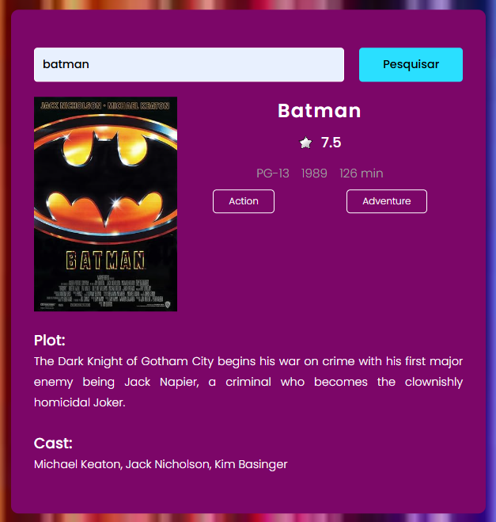
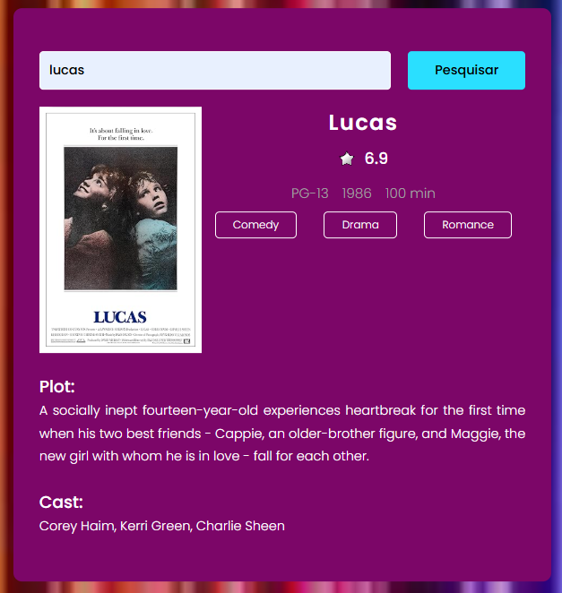
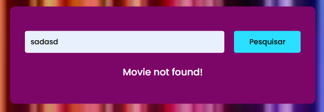

# 🎥 Filme-Section-Funcional
## Filme-Section-Funcional is a real-time movie search interface built using HTML, CSS, and JavaScript. This project allows users to search for movies and get actual data displayed on the screen, creating an interactive and responsive UI experience.

# 🚀 Key Features:
##✅ Functional Search Input:
### - Users can type the name of a movie and get real-time information using a JavaScript-powered API call.

## 🎞️ Dynamic Movie Display:
## Upon searching, the app displays:

### - Movie poster
### - Title
### - Rating
### - Year, classification, and duration
### - Genre tags
### - Plot description
### - Cast list

## ❌ Error Handling:
## If a movie is not found, a clear message is shown:
### - "Movie not found!"

## 🌐 Live Movie Data (possibly via OMDB API):
## The content is not hardcoded — the JavaScript fetches live data, possibly from a movie database like OMDb API, based on the search term.

## 📸 Visual Overview:
### - Batman Search Result
## Displays all relevant movie info with genres (Action, Adventure), rating (7.5), and cast.

### - Lucas Search Result
## Another example showing genres (Comedy, Drama, Romance) and accurate info fetched in real-time.

### - Error Message Example
## When typing a non-existent title like “sadasd”, the interface gracefully handles the error.

## 🧰 Technologies Used:

### - HTML/CSS – For layout and styling
### - JavaScript (Fetch API) – For retrieving and rendering movie data
### - OMDb API (assumed) – To pull real movie details
### - Responsive UI – Styled with a modern, colorful look using gradients and clean layout

## 🎯 Ideal For:

### - Beginners learning how to use APIs in JavaScript
### - Building the foundation for a full-featured movie app=
### - Practicing dynamic content rendering based on user input

  
  
  

